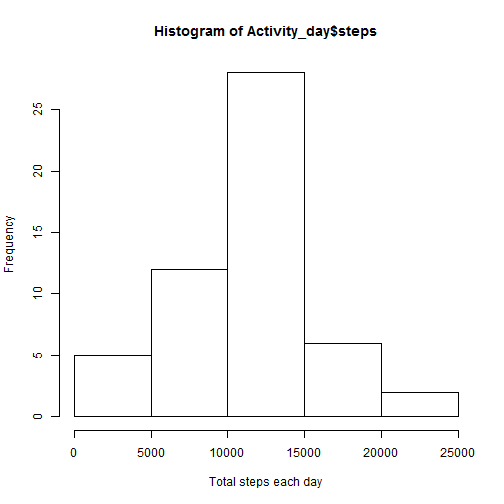
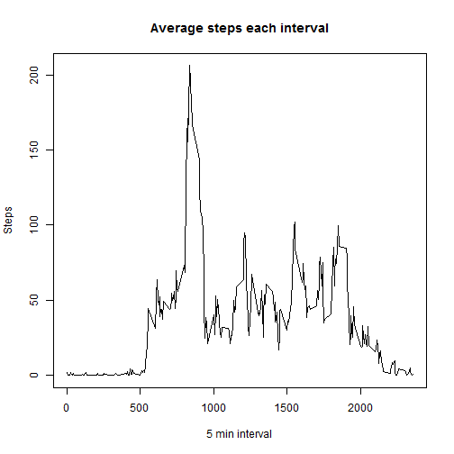
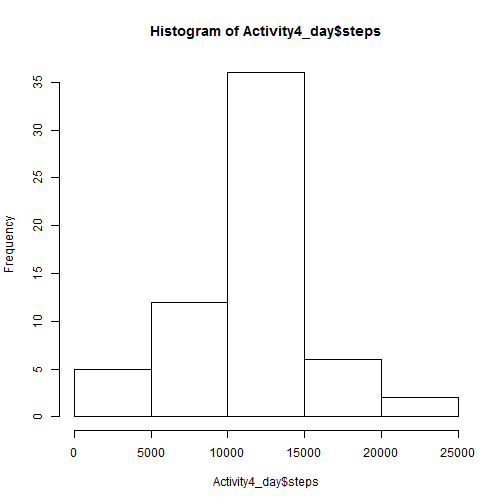
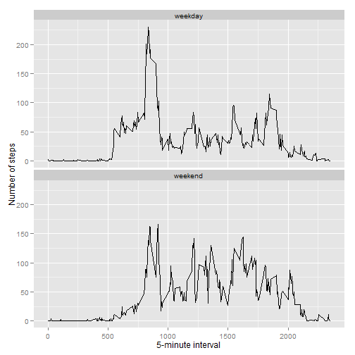

# Reproducible Research: Peer Assessment 1

##Loading and preprocessing the data


```r
unzip("activity.zip")
Activity<-read.csv("Activity.csv",header=T)
head(Activity)
```

```
##   steps       date interval
## 1    NA 2012-10-01        0
## 2    NA 2012-10-01        5
## 3    NA 2012-10-01       10
## 4    NA 2012-10-01       15
## 5    NA 2012-10-01       20
## 6    NA 2012-10-01       25
```
##What is mean total number of steps taken per day?


```r
#ignore missing values
Activity2<-subset(Activity,is.na(steps)==F)
#calculate total steps taken per day
Activity_day<-aggregate(x=list(steps=Activity2$steps),by=list(date=Activity2$date),FUN=sum)
hist(Activity_day$steps,xlab="Total steps each day")
```

 

```r
#median of total number of steps each day
median(Activity_day$steps)
```

```
## [1] 10765
```

```r
#mean of total number of steps each day
mean(Activity_day$steps)
```

```
## [1] 10766
```
##What is the average daily activity pattern?


```r
#calculate average number of steps each 5-min interval and plot it.
Activity_interval<-aggregate(x=list(steps=Activity2$steps),by=list(interval=Activity2$interval),FUN=mean)
plot(Activity_interval$steps~Activity_interval$interval,type="l",ylab="Steps",xlab="5 min interval",main="Average steps each interval")
```

 

```r
#find which interval has maximum number of steps
Activity_interval[which.max(Activity_interval$steps),]
```

```
##     interval steps
## 104      835 206.2
```

##Imputing missing values


```r
#report the number of missing values in the dataset.
nrow(subset(Activity,is.na(steps)==T))
```

```
## [1] 2304
```

```r
#filling in all of the mssing values with mean for each 5 min interval.
Activity3<-merge(Activity,Activity_interval,by="interval")
for ( i in 1:nrow(Activity3))
{
	if(is.na(Activity3$steps.x[i]))
	{
		Activity3$steps.x[i]<-Activity3$steps.y[i]
	}
}
#create a new dataset that is equal to the original dataset but with the missing data filled in.
Activity4<-Activity3[,1:3]
colnames(Activity4)<-c("interval","steps","date")
head(Activity4)
```

```
##   interval steps       date
## 1        0 1.717 2012-10-01
## 2        0 0.000 2012-11-23
## 3        0 0.000 2012-10-28
## 4        0 0.000 2012-11-06
## 5        0 0.000 2012-11-24
## 6        0 0.000 2012-11-15
```

```r
#calculate total number of steps taken each day and plot it
Activity4_day<-aggregate(x=list(steps=Activity4$steps),by=list(date=Activity4$date),FUN=sum)
hist(Activity4_day$steps)
```

 

```r
#report mean of total number of steps taken per day
mean(Activity4_day$steps)
```

```
## [1] 10766
```

```r
#report median of total number of steps taken per day.
median(Activity4_day$steps)
```

```
## [1] 10766
```

##Are there differences in activity patterns between weekdays and weekends?


```r
#create a new factor variable in the dataset with two levels--"weekend" & "weekend"
week<-weekdays(as.Date(Activity4$date))
for(i in 1:length(week))
{
	if(week[i]=="Saturday"|week[i]=="Sunday")
		week[i]<-"weekend"
	else
		week[i]<-"weekday"
}
Activity4$weekdays<-week
#calculate the average number of steps taken each 5 min interval and plot it.
averages <- aggregate(steps ~ interval + weekdays, data=Activity4, mean)
library(ggplot2)
ggplot(averages, aes(interval, steps),fill=weekdays) + geom_line() + facet_wrap(~weekdays,ncol=1) +
   xlab("5-minute interval") + ylab("Number of steps")
```

 
